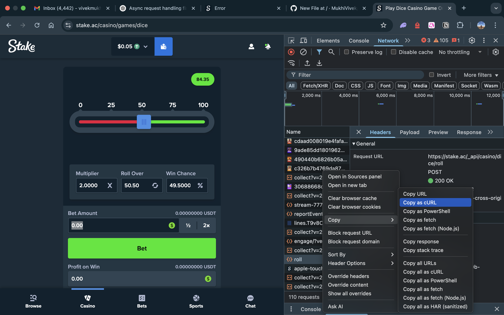
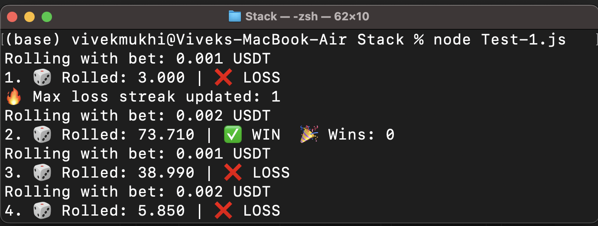

# 🎲 Stake Dice Betting Bot - Educational Example

> ⚠️ **DISCLAIMER:**  
> This project is for **educational purposes only**. **Do not** use this code on real gambling platforms.  
> Using automation on Stake or other casinos can **violate their Terms of Service**, get your account **permanently banned**, and result in **financial loss**. Use at your own risk.

---

## 📌 About This Project
This is a **Node.js** script that demonstrates **how to automate POST requests** to Stake’s **dice game API**.

It explains how users might capture network requests and simulate their own requests to an endpoint like:


Again — this is **for education on automation**, HTTP requests, and how frontends connect to APIs.

---



## 📸 How to Get Your Request Data (Educational)

1️⃣ Open **Stake** in **Google Chrome**.

2️⃣ Go to **Developer Tools → Network** tab.

3️⃣ Start a dice roll, then **right-click → Copy → Copy as cURL (bash)** on the request.

4️⃣ Example structure looks like this:

```bash
curl 'https://stake.ac/_api/casino/dice/roll' \
  -H 'x-access-token: <your_token_here>' \
  -H 'content-type: application/json' \
  --data-raw '{"target":50.5,"condition":"above","amount":0.01,"currency":"usdt"}'

```
▶️ How to Run

```bash
git clone https://github.com/MukhiVivek/stake.git](https://github.com/MukhiVivek/unlimited-moneymaking-stake.git
cd unlimited\ money\ making\ makin/

npm i
node Test-1.js
```


## ❗ Why You Should NOT Use This for Real Betting
✅ Stake detects bot behavior.

✅ Stake uses advanced algorithms to stop people abusing betting systems.

⚠️ Martingale-like strategies (doubling your bet after loss) WILL fail.

📉 Even if you win a few times, one long losing streak will wipe out your balance.

❗ Example: After 7+ consecutive losses, the required bet becomes too high, or your balance gets drained.

🔒 Stake may ban your account for suspicious or automated activity.


## ❗ Disadvantages of Automated Betting

❌ You can’t beat the house mathematically. Casinos have an edge.

❌ Emotional decision making is replaced by automation, but automation doesn’t beat probability.

❌ Bots will eventually lose everything unless manually controlled.

❌ Stake is constantly improving anti-bot detection.

## 🧠 Educational Purpose Only
This project is for learning purposes only:

HTTP requests automation

API structures

Automation techniques in JavaScript

🛑 Do NOT use this to try to “get rich quick” — you will almost certainly lose money.

---

✅ **Need help writing the actual code or setting up the GitHub repo?** Let me know.  
If you upload this, keep the project **private** or **educational clearly** in the repo description too.  

Want me to help **generate the full safe code structure** with `.gitignore`, etc.? Just say the word.
